# Receive 810(EDI Invoice) in B2B cloud using http/https and create an expense report in Concur using the Invoice statement.

Let us consider a use case where a hotel chain, Hilton, would like to receive business documents from its partner using webMethods B2B Cloud. The partner, Costco, is a supplier of organic food items. It uses different document types like purchase orders, invoices and other food industry specific documents.
Costco is the partner which shares the Invoice 810 EDI file over http/https protocol. As an enterprise, Hilton should configure webMethods B2B cloud to enable the exchange of 
business documents with its partner. 
This design time configuration can be performed using B2B cloud UI. This involves creation of:
	Enterprise profile (A profile that represents the hotel chain)
	Partner profile (Profile that represents the partner)
	Partner users
	Communication channels
	Processing rules
	
## Prerequisites
1. You need Software AG webmethods.io B2B cloud tenant and webmethods.io integration cloud tenant. If you don't have one; sign up for free 30 trial tenant at [Software AG B2B](https://signup.softwareag.cloud/#/?product=b2b)

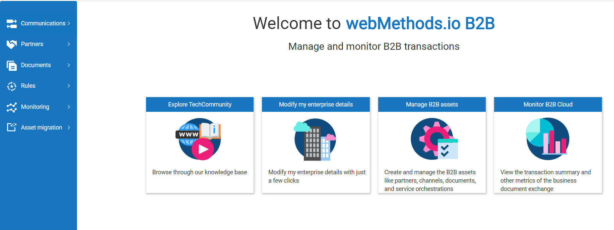

## Transaction Flow
1. Partner (Postman client) sends EDI 810 to B2B Cloud via HTTP/HTTPS
2. B2B Cloud executes the processing rule based on a criteria for senderid, receiverid, document type
3. B2B cloud executes the action defined in processing rule which is configured to call webmethods.io Integration for further mapping. The integration does the following
	- Receive EDI 810 file
	- Parse EDI 810 file 
	- Extract the 810 EDI invoice fields and map it to Concur create Expense api.
	- Create the Expense report in Concur for the received Invoice

## Design time configuration

### Setting up enterprise and partner profile
To setup a profile for the enterprise (Hilton), Click Set up my B2B Enterprise on the welcome screen to open the guided wizard.
Enter the Name and Organization Unit of the enterprise.

Click Add Identity to add information on identities.

The next screens request you to add information about contacts and addresses. This information is necessary for the partner to communicate the enterprise.
Once the enterprise profile is created, you will see that it is set to Active by default.
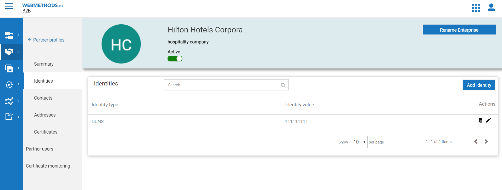

### Create partner profile
Partners are a group of organizations that have agreed to exchange business documents. In order to identify these partners, partner profiles need to be created.

To create a new partner, click Add Partner in Partner profiles section.

Create a partner Costco with DUNS number as the identity type.

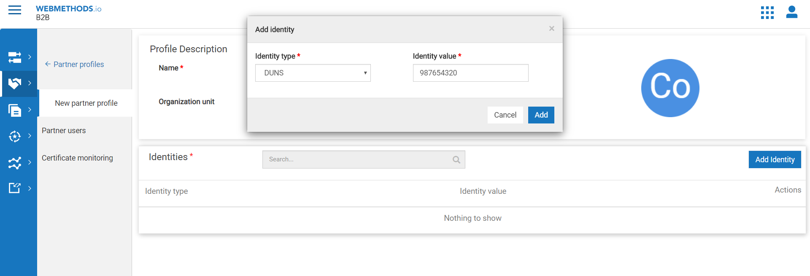

As you can see, a partner profile is Not Active by default. Once all the required configurations are done, we can activate the profile.
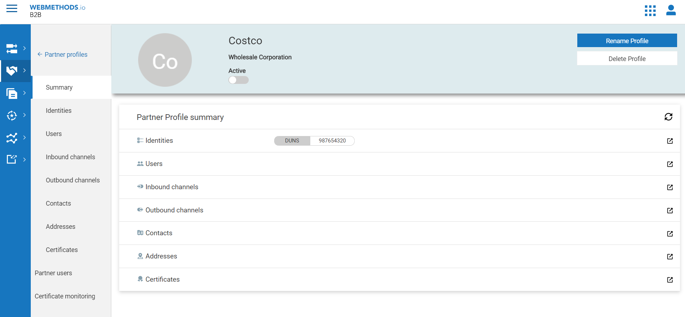

### Create partner user
Only authorized users of a partner can send documents to B2B Cloud.
To create a partner user, click Add Partner User in Partner users section.

Create a partner user sam along with password information.

### Channels-Creating Inbound channels
A channel forms the basis of communication in B2B Cloud and facilitates document exchange.
There are two types of channels - Inbound (to receive documents) and Outbound (to send documents).

In Channels section, click Add Channel and choose Inbound Channel.
Choose the Channel type as HTTP listener and provide the name and description.
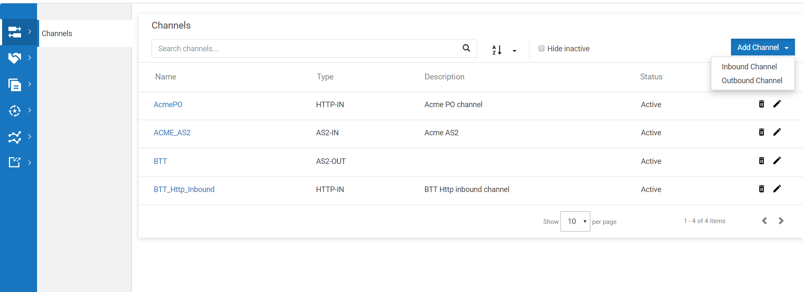

Once the channel is created, you will see that the channel is Active by default. Also, note the HTTP endpoint URL which will be used by the partner to send documents.

### Associations-Associate partner user with partner profile
To send a document to B2B Cloud, a partner must have at least one partner user associated with it.
Let us now associate the user sam with partner Costco.
Go the Users section of the profile page of Costco, click Associate User and add the user "sam".

### Associations-Associate inbound channel with partner profile
You should associate an inbound channel with a partner to receive business documents through the configured endpoint.
Here, we need to associate the inbound channel HTTP-Inbound-Channel with partner Costco.
Go the Inbound channels section of the profile page of Costco, click Associate Inbound Channel and add the channel "HTTP-Inbound-Channel".
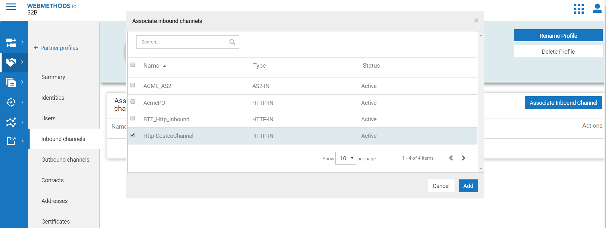

### Activate partner profile
Activate the partner profile of Costco by enabling the Active toggle in the partner profile Summary page.

### Business documents
Generate the X12 4010 810 document by clicking on add document and select edi in drop down. 

Then select the Standard=X12, Version=4010 and Transaction=810 and click on save.
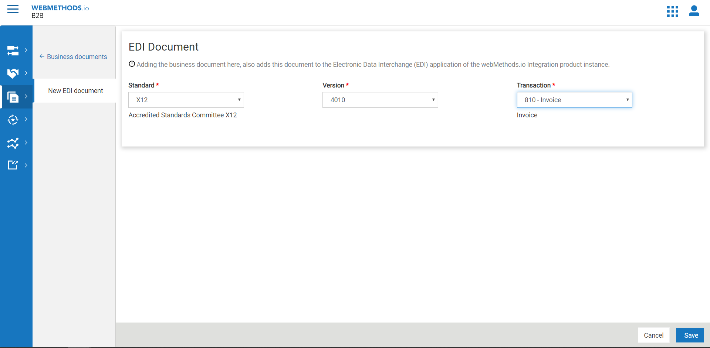
The 810 Invoice document will be generated and activated.

### Proccesing Rule-Create processing rule
Processing rules specify how you want B2B Cloud to process the inbound documents and the specific actions to take after a document matches with the specified criteria. They get executed in the order of precedence.

In order to place the new rule first in the sequence, click on the first rule in the list, click Add Processing Rule and choose Above.
Enter the Name and Description of the rule. Note that the Sequence of the rule is First.

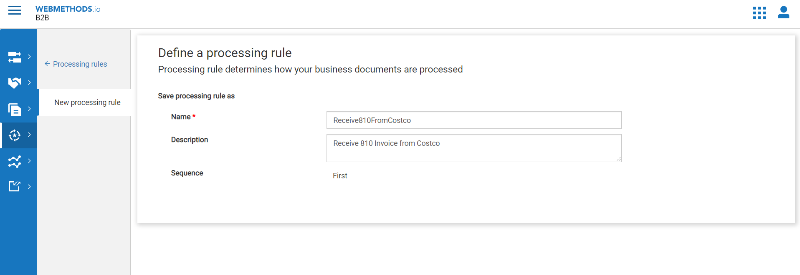

### Proccesing Rule-Configure criteria
The criteria defines who the sender and receiver should be, the type of document allowed, etc.
Choose the sender as Costco and the receiver as Enterprise (which is Hilton, in our case).
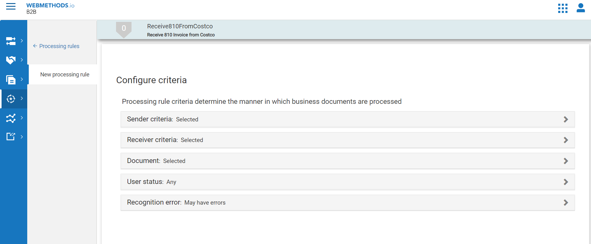

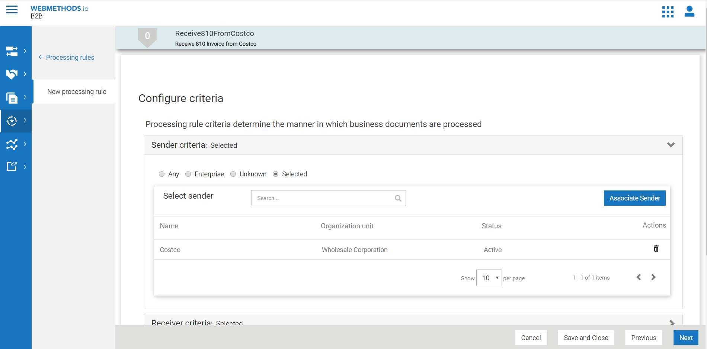

### Proccesing Rule-Configure pre-processing options
These options are used for performing operations prior to the actual processing actions.
Let us continue with the default selection that is present. The selection Defer to business document means the value provided in the business document will be considered.
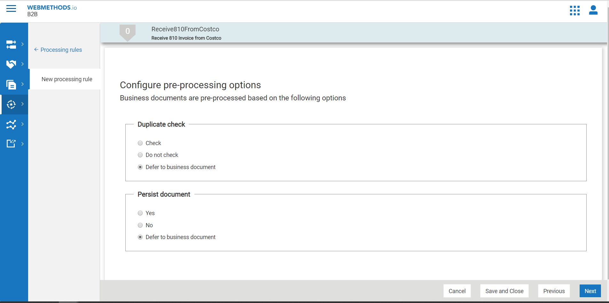

### Proccesing Rule-Configure action
These are actions that will be executed once the criteria is met and the pre-processing is completed.

We shall configure the action Call an integration. This will enable B2B Cloud to call an integration URL on webMethods Integration Cloud using valid credentials.

Enter the integration URL, Username and Password. Reliable execution mode is chosen by default (This mode automatically retries failed integration).
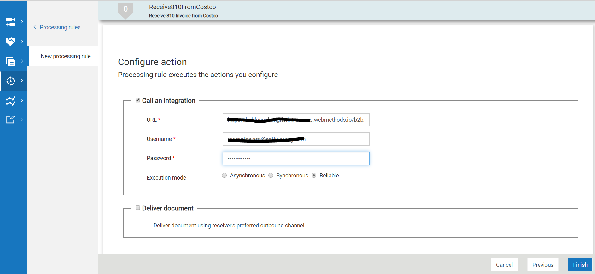

### Proccesing Rule-Activate processing rule
By default, any newly created processing rule is not activated. Activate the processing rule High Priority Rule by enabling the Active toggle in the Summary page.
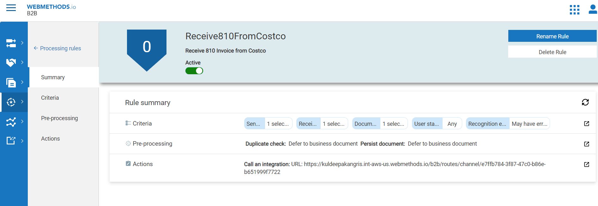

### Create the concur Account and Action
Switch to webmethods.io flow editor perspective and under the specific(B2BDemo) project go to applications.
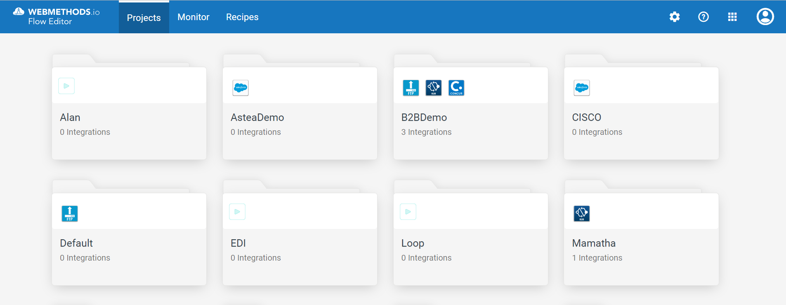
Choose the Concur application and create the Account for concur by entering the oAuth credentials.
 

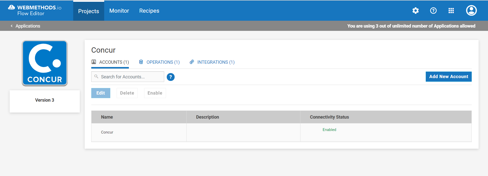 

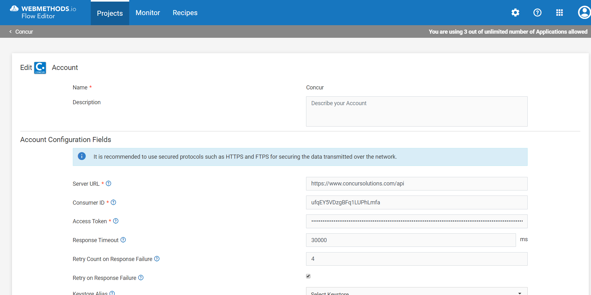

Then once the Account is active create the Action "CreateExpense" by choosing the functional area as "ExpenseManagement" and operation as "create QuickExpense"
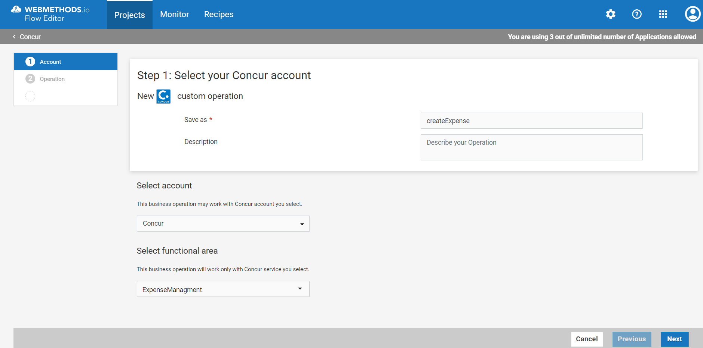

### We shall configure the service under the same project(B2BDemo) called "ProcessInvoice810" which does the below operations.
	1.Parse the EDI content by invoking parseContent Service
	2.Process the envelope message to get the envelope details(sender,receiver,message type, etc)
	3.Convert the EDI message to document.
	4.map the Invoice edi data to "createExpense" action.
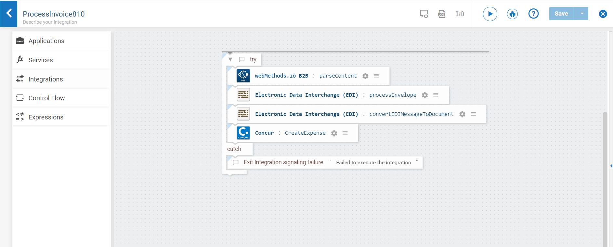 
	
## Sharing details to partners
You need to share the inbound channel endpoint details with the partner in order for them to send documents. A partner can use any HTTP client to send a business document to the endpoint URL.

Share endpoint and user details to partner
Details that need to be shared are - Endpoint URL and Partner User Credentials.

You will find the endpoint URL of the inbound channel and user credentials in the partner profile summary page of Costco.

In our example, the endpoint URL is https://b2btenant.webmethodscloud.com/b2b/routes/channel/ebf06578-f698-4675-aeaa-1b6d8742bbf4 and partner user is sam.

## Testing
### Sending document to an inbound channel
Now that we have configured an inbound channel and associated it with a partner profile, we will be able to send an EDI document to this channel's endpoint.
	1.Open Postman client
	2.Select HTTP POST method
	3.Specify the HTTP request URL as the inbound channel's endpoint URL
	4.Under Authorization, set the Authorization to Basic Auth and specify the username and password configured as the partner user 	credentials
	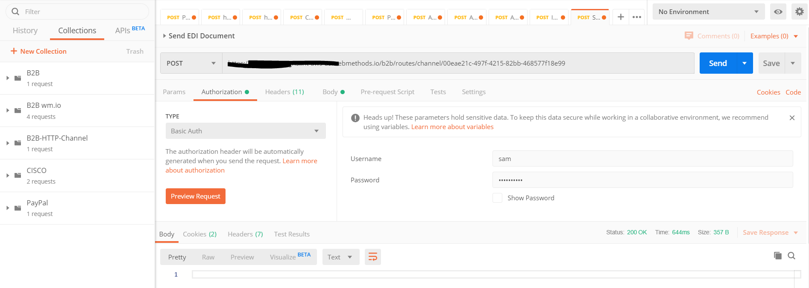 
	5.Under Headers, set Content-Type header as application/edi
	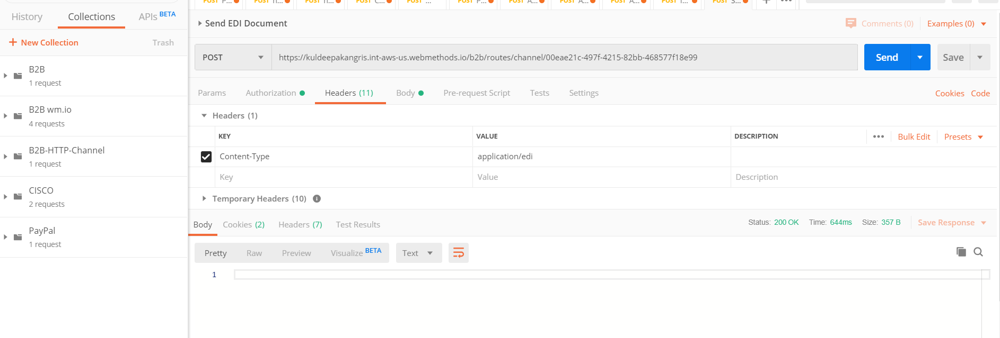
	6.Under Body, choose the type as raw and paste the below document content
	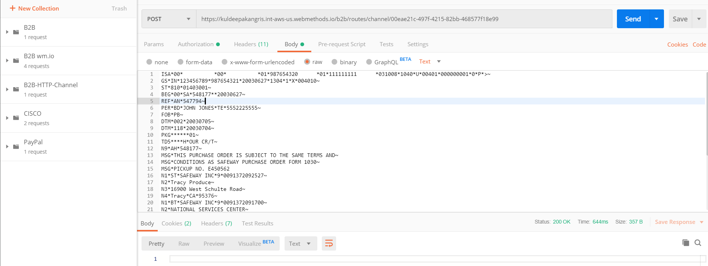
	7.Send or submit the request. You should receive a 200 OK response

### Monitoring
Please login to B2B cloud and go to Transactions and observe the transaction and also login to concur and check whether expense has been created.

B2B Cloud Transaction monitoring

webMethods.io flow editor monitoring
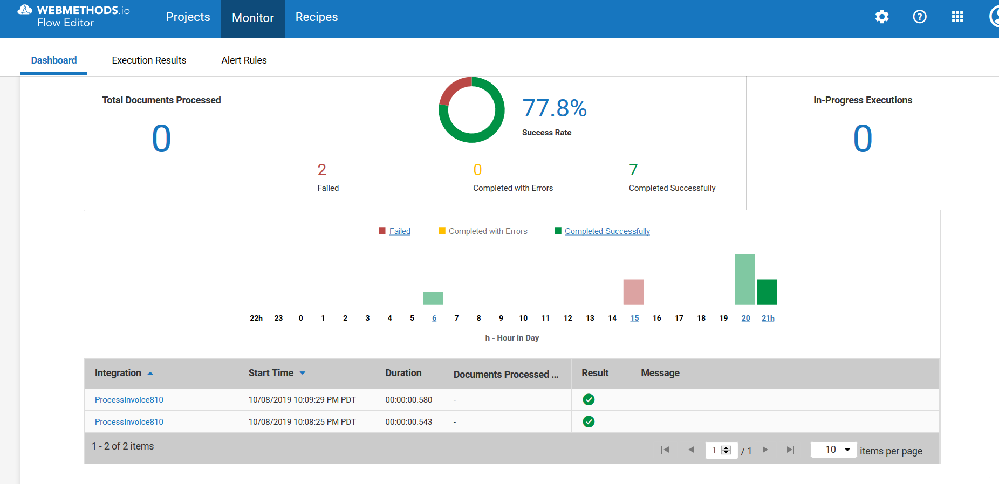
Concur expense creation
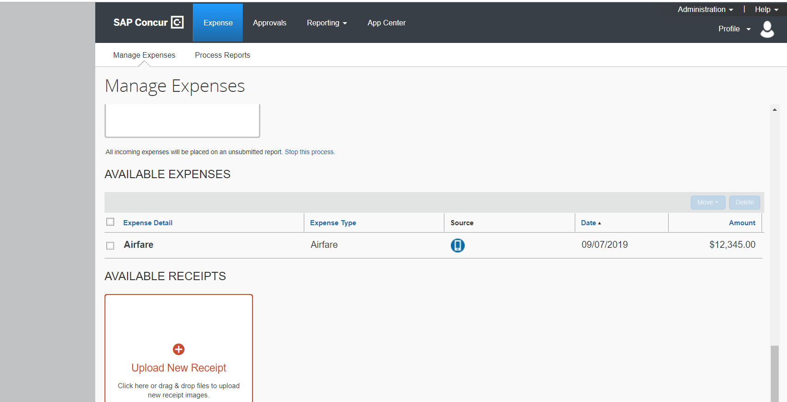

